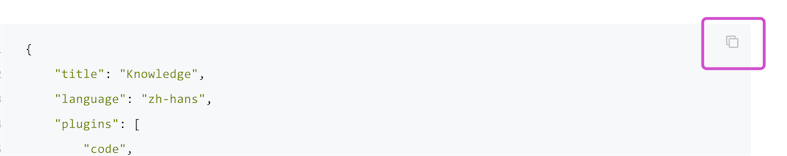
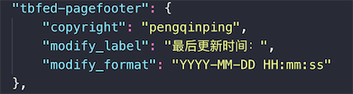
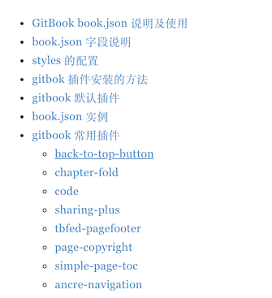

<!-- toc -->

# GitBook 详解

## GitBook book.json 说明及使用

|Question|Answer|
|:--|:--|
|`book.json`是用来做什么的?|配置 `Gitbook` 生成静态页面的配置文件|
|`book.json`怎么创建放在那里？|手动创建，`gitbook` 项目的根目录，和 [SUMMARY.md](../SUMMARY.md) 同级|
|`book.json`有哪些配置？|`title`, `author`, `description`, `language`, `links` , `styles`, `plugins`, `pluginsConfig`  <br>  [字段说明](#attribute)  <br>  [本项目book.json配置](#book_json)|
|styles中的样式指定文件`( "website": "assert/style/website.css",)`怎么生成？|自己创建和编写，根据需求调整样式，路径可以自己定义， <br>  [详细配置](#styles)|
|在book.json配置plugins 后怎么生效呢？| 1. 首先插件要配置正确，名称千万不要错，<br> 2. 安装插件，[这里介绍三种方法](#plugin_install) <br> 3. gitbook buil 即可生效|
|默认插件有哪些？屏蔽默认插件如何操作|1. 屏蔽默认插件，在 `book.json` 中 的 `plugins` 中配置 `-highlight` 这样就去掉了默认的高亮插件， <br>2. [默认的插件有](#default_plugins)|
|常见的插件有哪些？|[常见的插件说明及使用](#some_plugins)|


## book.json 字段说明
<div id="attribute"></div>

|属性|含义|Demo|
|:--|:--|:--|
|title|设置书本的标题|"title": "Knowledge"|
|author|作者的相关信息|"author": "Royal"|
|description|本书的简单描述|"description":"这是我的环境配置说明"|
|language|Gitbook使用的语言| "language": "zh-hans"|
|styles|自定义页面样式，用于 book build|"style":{ "website": "assert/style/website.css"}|
|plugins|插件列表|"plugins":{"back-to-top-button"}|
|pluginsConfig| 插件配置 | 具体配置根据使用的插件进行配置 |


## styles 的配置
<div id="styles" ></div>

> 目前style配置根据导出的文件类型来，目前也就下面几种类型

|styles Key|含义|
|:--|:--|
|website|生成Html将会使用的样式文件|
|ebook|生成ebook.....|
|pdf|生成pdf.....|
|mobi|生成mobi.....|
|epub|生成epub.....|

## gitbok 插件安装的方法
<div id="plugin_install"></div>

1. 在根目录下执行 `gitbook install` 
2. 使用npm安装，命令格式 `npm install gitbook-plugin-插件名字`，如 `npm install gitbook-plugin-code`
3. 从 `GitHub` 下载源码，放到`node_modules`文件夹里

## gitbook 默认插件
<div id="default_plugins"></div>

|插件名词|说明|
|:--|:--|
|highlight：|代码高亮|
|search：|导航栏查询功能（不支持中文）|
|sharing：|右上角分享功能|
|font-settings：|字体设置（最上方的"A"符号）|
|livereload：|为GitBook实时重新加载|

## book.json 实例
<div id="book_json"></div>

```json
{
    "title": "Knowledge",
    "language": "zh-hans",
    "plugins": [
        "code",
        "back-to-top-button",
        "tbfed-pagefooter",
        "search-pro",
        "fontsettings",
        "simple-page-toc",
        "links"
    ],
    "styles": {
        "website": "assert/style/website.css",
        "ebook": "assert/style/ebook.css",
        "pdf": "assert/style/pdf.css",
        "mobi": "assert/style/mobi.css",
        "epub": "assert/style/epub.css"
    },
    "pluginsConfig": {
        "tbfed-pagefooter": {
            "copyright": "pengqinping",
            "modify_label": "最后更新时间：",
            "modify_format": "YYYY-MM-DD HH:mm:ss"
        }, 
        "fontsettings": {
            "theme": "white",
            "family": "serif",
            "size": 12
        },
        "simple-page-toc": {
            "maxDepth": 3,
            "skipFirstH1": true
        },  
        "links": {
            "gitbook": false
        }
    }
}
```

## gitbook 常用插件
> 参考地址：https://www.jianshu.com/p/427b8bb066e6
> 插件大全：https://zhaoda.net/2015/11/09/gitbook-plugins/
> 插件大全：http://gitbook.zhangjikai.com/plugins.html#gitbook-%E6%8F%92%E4%BB%B6

<div id="some_plugins"></div>

### back-to-top-button
|插件名词|back-to-top-button 返回头部|
|:--|:--|
|修改配置| 在book.json 中新增插件 `"plugins" : [ "page-toc-button" ]`<br> 新增插件配置 `"pluginsConfig": { "page-toc-button": {"maxTocDepth": 2,  "minTocSize": 2} }`|
|安装方法|1. `gitbook install` <br> 2. `npm install gitbook-plugin-back-top-button` | 
|图示||

### chapter-fold
|插件名词|chapter-fold 折叠目录|
|:--|:--|
|修改配置| 在book.json 中新增插件 `"plugins" : [ "chapter-fold" ]`|
|安装方法|1. `gitbook install` <br> 2. `npm install gitbook-plugin-chapter-fold` |
|图示||

### code
|插件名词|code 显示代码copy按钮|
|:--|:--|
|修改配置| 在book.json 中新增插件 `"plugins" : [ "code" ]` <br> 新增配置 `"pluginsConfig": { "code": {"copyButtons": false } }` |
|安装方法|1. `gitbook install` <br> 2. `npm install gitbook-plugin-code` |
|参数配置|`copyButtons` 是否显示 copy 按钮 |
|图示||

### sharing-plus
|插件名词|sharing-plus 分享插件|
|:--|:--|
|修改配置| 在book.json 中新增插件 `"plugins" : [ "sharing-plus" ]` <br> 新增配置  |
|安装方法|1. `gitbook install` <br> 2. `npm install gitbook-plugin-sharing-plus` |
|参数配置|为true的代表直接显示在页面顶端，为false的不显示，不写默认为false "all"中代表点击分享符号显示出来的 |
|图示||

### tbfed-pagefooter
|插件名词|tbfed-pagefooter 页面添加页脚| 
|:--|:--|
|修改配置| 在book.json 中新增插件 `"plugins" : [ "tbfed-pagefooter" ]` <br> 新增配置  |
|安装方法|1. `gitbook install` <br> 2. `npm install gitbook-plugin-tbfed-pagefooter` |
|图示||

### page-copyright 
|插件名词|page-copyright 页面添加页脚|
|:--|:--|
|修改配置| 在book.json 中新增插件 `"plugins" : [ "page-copyright" ]` <br> 新增配置  |
|安装方法|1. `gitbook install` <br> 2. `npm install gitbook-plugin-page-copyright ` |
|图示|暂时无图，可以自己配置|

### simple-page-toc
|插件名词|simple-page-toc  生成本页目录|
|:--|:--|
|修改配置| 在book.json 中新增插件 `"plugins" : [ "simple-page-toc" ]` <br> 新增配置 `"simple-page-toc": {  "maxDepth": 3,  "skipFirstH1": true}` |
|安装方法|1. `gitbook install` <br> 2. `npm install gitbook-plugin-simple-page-toc ` |
|参数说明 | `maxTocDepth` 标题的最大深度（2 = h1 + h2 + h3）。不支持值> 2 <br> `minTocSize` 显示toc按钮的最小toc条目数。|
|新增方法|使用方法: 在需要生成目录的地方用下面的标签括起来，全文都生成的话就在首尾添加 `&lt;!-- toc --&gt;` `&lt;!-- endtoc --&gt;`|
|图示||

### ancre-navigation 
|插件名词|ancre-navigation  悬浮目录和返回|
|:--|:--|
|修改配置| 在book.json 中新增插件 `"plugins" : [ "ancre-navigation" ]`|
|安装方法|1. `gitbook install` <br> 2. `npm install gitbook-plugin-ancre-navigation ` |
|图示||

### klipse 
|插件名词|klipse 嵌入类似IDE的功能|
|:--|:--|
|修改配置| 在book.json 中新增插件 `"plugins" : [ "klipse" ]`|
|安装方法|1. `gitbook install` <br> 2. `npm install gitbook-plugin-klipse ` |
|支持语言|`Javascript` ,`ruby`,`C++`, `PHP` ,`Python`, `JSX` ,`EcmaScript2017`,`Google Charts`,`Scheme`, `BrainFuck`|
|代码实例|如下|

```eval-python 
print [x + 1 for x in range(10)]
```

### donate
|插件名词|donate 打赏插件|
|:--|:--|
|修改配置| 在book.json 中新增插件 `"plugins" : [ "donate" ]` <br> `"pluginsConfig": { "donate": { "wechat": picWeChar,"alipay": zfbpic,  "title": "","button": "赏","alipayText": "支付宝打赏", "wechatText": "微信打赏" } }`|
|安装方法|1. `gitbook install` <br> 2. `npm install gitbook-plugin-donate ` |
|参数说明|`wechat` 微信收款图片 <br> `alipay` 支付宝收款图片<br> |
|图示|无测试图片|

### pageview-count
|插件名词|pageview-count 阅读量计数|
|:--|:--|
|修改配置| 在book.json 中新增插件 `"plugins" : [ "ageview-count" ]`|
|安装方法|1. `gitbook install` <br> 2. `npm install gitbook-pageview-count ` |
|图示||

### popup
|插件名词|popup 弹出大图|
|:--|:--|
|修改配置| 在book.json 中新增插件 `"plugins" : [ "popup" ]`|
|安装方法|1. `gitbook install` <br> 2. `npm install gitbook-popup ` |
|图示|点击图片弹出预览|

<!-- endtoc -->